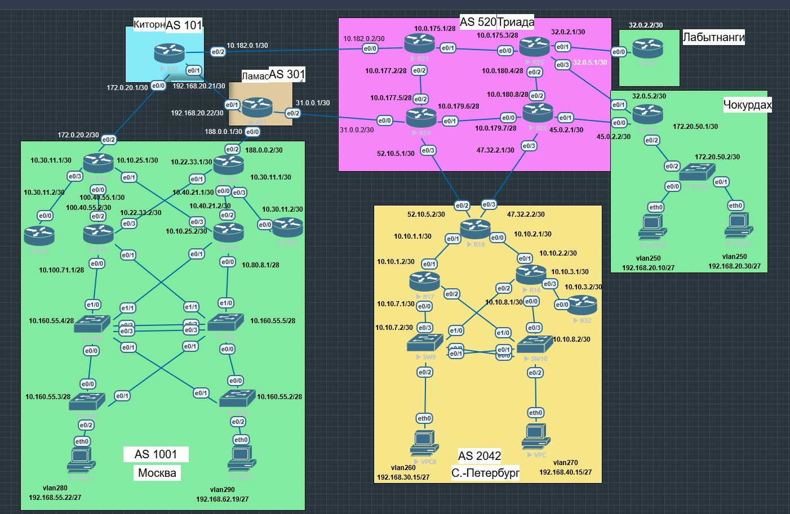

# Репозиторий лабораторных работ курса "Сетевой инженер" в OTUS.ru

## Домашнее задание
Проектирование сети

Цель:
распланировать адресное пространство, настроить IP на активных портах для дальнейшей работы над проектом и задокументировать адресацию.

Описание/Пошаговая инструкция выполнения домашнего задания:
В этой самостоятельной работе мы ожидаем, что вы самостоятельно:

1. Разработаете и задокументируете адресное пространство для лабораторного стенда.
2. Настроите ip адреса на каждом активном порту
3. Настроите каждый VPC в каждом офисе в своем VLAN.
4. Настроите VLAN/Loopbackup interface управления для сетевых устройств
5. Настроите сети офисов так, чтобы не возникало broadcast штормов, а использование линков было максимально оптимизировано
6. Используете IPv4. IPv6 по желанию

### 1 Таблица адресного пространство для стенда:
Адресация для провайдеров:

| № | От (исходный маршрутизатор) | Интерфейс | Кому (целевой маршрутизатор) | Интерфейс | IP-адрес (исходный) | IP-адрес (целевой) | Маска подсети |
|:---:|:---|:---:|:---|:---:|:---:|:---:|:---:|
| 1 | Киторн (R22) | e0/0 | АС1001 (R14) | e0/2 | 172.0.20.1 | 172.0.20.2 | /30 |
| 2 | Киторн (R22) | e0/1 | Ламас (R21) | e0/1 | 5.83.32.1 | 5.83.32.2 | /30 |
| 3 | Киторн (R22) | e0/2 | Триада (R23) | e0/0 | 10.182.0.1 | 10.182.0.2 | /30 |
| 4 | Ламас (R21) | e0/0 | АС1001 (R15) | e0/2 | 188.0.0.1 | 188.0.0.2 | /30 |
| 5 | Ламас (R21) | e0/2 | Триада (R24) | e0/0 | 31.0.0.1 | 31.0.0.2 | /30 |
| 6 | Триада (R25) | e0/1 | Лабытнанги (R27) | e0/0 | 32.0.2.1 | 32.0.2.2 | /30 |
| 7 | Триада (R25) | e0/3 | Чокурдах (R28) | e0/1 | 32.0.5.1 | 32.0.5.2 | /30 |
| 8 | Триада (R26) | e0/1 | Чокурдах (R28) | e0/0 | 45.0.2.1 | 45.0.2.2 | /30 |
| 9 | Триада (R24) | e0/3 | AS2042 Питер (R18) | e0/2 | 52.10.5.1 | 52.10.5.2 | /30 |
| 10 | Триада (R26) | e0/3 | AS2042 Питер (R18) | e0/3 | 47.32.2.1 | 47.32.2.2 | /30 |

Внутренняя адресация провайдера(AS520 Триада):
| № | От (исходный маршрутизатор) | Интерфейс | Кому (целевой маршрутизатор) | Интерфейс | IP-адрес (исходный) | IP-адрес (целевой) | Маска подсети | Тип |
|:---:|:---|:---:|:---|:---:|:---:|:---:|:---:|:---:|
| 1 | R23 (Триада) | e0/1 | R25 (Триада) | e0/0 | 10.0.175.1 | 10.0.175.2 | /28 
| 2 | R23 (Триада) | e0/2 | R24 (Триада) | e0/2 | 10.0.177.2 | 10.0.177.8 | /28 
| 3 | R25 (Триада) | e0/2 | R26 (Триада) | e0/2 | 10.0.180.4 | 10.0.180.8 | /28 
| 4 | R24 (Триада) | e0/1 | R26 (Триада) | e0/0 | 10.0.179.6 | 10.0.179.7 | /28 

Чокурдах:
| № | От (исходный маршрутизатор) | Интерфейс | Кому (целевой маршрутизатор) | Интерфейс | IP-адрес (исходный) | IP-адрес (целевой) | Маска подсети | Назначение |
|:---:|:---|:---:|:---|:---:|:---:|:---:|:---:|:---|
| 1 | Чокурдах (R28) | e0/0 | Триада (R26) | e0/1 | 45.0.2.2 | 45.0.2.1 | /30 | Внешнее соединение |
| 2 | Чокурдах (R28) | e0/1 | Триада (R25) | e0/3 | 32.0.5.2 | 32.0.5.1 | /30 | Внешнее соединение |
| 3 | Чокурдах (R28) | e0/2 | SW29 | e0/2 | 172.20.50.1 | 172.20.50.2 | /30 | Доступ в локальную сеть |
**Клиентские устройства** 
| 4 | SW29 | VLAN 250 | VPC30 | — | 192.168.20.10 | — | /27 | Клиентский ПК |
| 5 | SW29 | VLAN 250 | VPC31 | — | 192.168.20.30 | — | /27 | Клиентский ПК |

адресация АС1001 (Москва)
| № | От (исходный маршрутизатор) | Интерфейс | Кому (целевой маршрутизатор) | Интерфейс | IP-адрес (исходный) | IP-адрес (целевой) | Маска подсети | Тип/Назначение |
|:---:|:---|:---:|:---|:---:|:---:|:---:|:---:|:---|
| **Маршрутизаторы — внешние соединения** |
| 1 | R14 (АС1001) | e0/3 | R19 | e0/0 | 10.132.35.1 | 10.132.35.2 | /30 | P2P-линк |
| 2 | R14 (АС1001) | e0/0 | R12 | e0/2 | 100.40.55.1 | 100.40.55.2 | /30 | P2P-линк |
| 3 | R14 (АС1001) | e0/1 | R13 | e0/3 | 10.10.25.1 | 10.10.25.2 | /30 | P2P-линк |
| 4 | R15 (АС1001) | e0/3 | R20 | e0/0 | 10.30.11.1 | 10.30.11.2 | /30 | P2P-линк |
| 5 | R15 (АС1001) | e0/0 | R13 | e0/2 | 10.40.21.1 | 10.40.21.2 | /30 | P2P-линк |
| 6 | R15 (АС1001) | e0/1 | R12 | e0/3 | 10.22.33.1 | 10.22.33.2 | /30 | P2P-линк |
| **Маршрутизаторы — подключение к коммутаторам** |
| 7 | R12 | e0/0 | SW4 | e1/0 | 10.100.71.1 | — | /28 | Связь с коммутатором |
| 8 | R13 | e0/0 | SW5 | e1/0 | 10.80.8.1 | — | /28 | Связь с коммутатором |
| **Коммутаторы — VLAN 3 (управление)** |
| 9 | SW2 | e1/0 | — | — | 10.160.55.2 | — | /28 | VLAN 3 (управление) |
| 10 | SW3 | e1/0 | — | — | 10.160.55.3 | — | /28 | VLAN 3 (управление) |
| 11 | SW4 | e1/0 | — | — | 10.160.55.4 | — | /28 | VLAN 3 (управление) |
| 12 | SW5 | e1/0 | — | — | 10.160.55.5 | — | /28 | VLAN 3 (управление) |
| **Клиентские устройства** |
| 13 | VPC1 | — | — | — | 192.168.55.22 | — | /27 | VLAN 280 (клиентский ПК) |
| 14 | VPC7 | — | — | — | 192.168.62.19 | — | /27 | VLAN 290 (клиентский ПК) |

адресация АС2042 (Питер)
| № | От (исходный маршрутизатор) | Интерфейс | Кому (целевой маршрутизатор) | Интерфейс | IP-адрес (исходный) | IP-адрес (целевой) | Маска подсети | Назначение |
|:---:|:---|:---:|:---|:---:|:---:|:---:|:---:|:---|
| **Маршрутизаторы — P2P-соединения** |
| 1 | R18 (AS2042) | e0/1 | R17 | e0/1 | 10.10.1.1 | 10.10.1.2 | /30 | P2P-линк |
| 2 | R18 (AS2042) | e0/1 | R16 | e0/1 | 10.10.2.1 | 10.10.2.2 | /30 | P2P-линк |
| 3 | R17 | e0/0 | SW9 | e0/3 | 10.10.7.1 | 10.10.7.2 | /30 | Связь с коммутатором |
| 4 | R16 | e0/3 | R32 | e0/0 | 10.10.3.1 | 10.10.3.2 | /30 | P2P-линк |
| 5 | R16 | e0/0 | SW10 | e0/3 | 10.10.8.1 | 10.10.8.2 | /30 | Связь с коммутатором |
| 6 | SW9 | e0/3 | — | — | 10.170.120.9 | — | /28 | VLAN 3 (управление) |
| 7 | SW10 | e0/3 | — | — | 10.170.120.10 | — | /28 | VLAN 3 (управление) |
| **Клиентские устройства** |
| 6 | VPC8 | — | — | — | 192.168.30.15 | — | /24 | VLAN 260 (клиентский ПК) |
| 7 | VPC | — | — | — | 192.168.40.45 | — | /24 | VLAN 270 (клиентский ПК) |

Итог:
